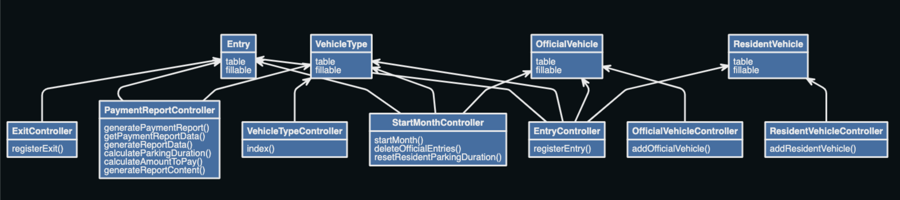
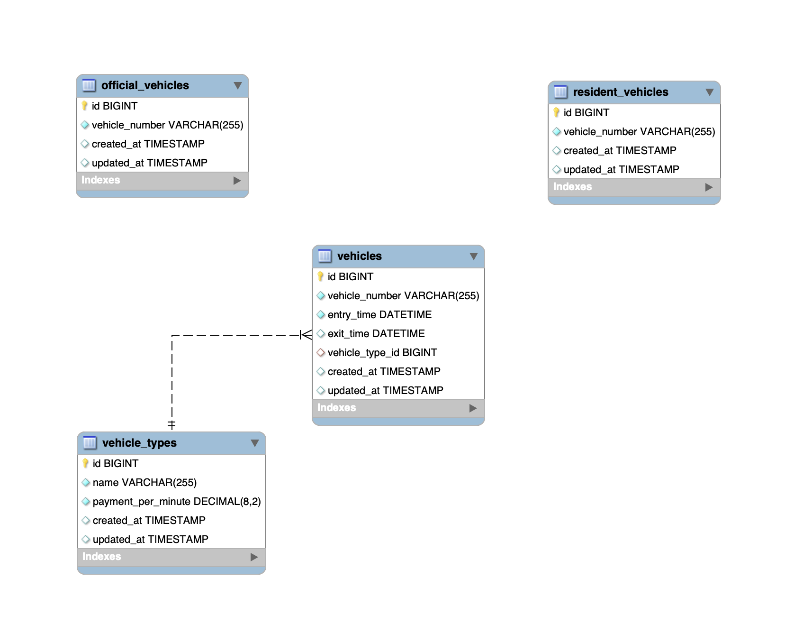

<p align="center"><a href="https://laravel.com" target="_blank"></a></p>

<p align="center">
<a href="https://github.com/laravel/framework/actions"></a>
<a href="https://packagist.org/packages/laravel/framework"></a>
<a href="https://packagist.org/packages/laravel/framework"></a>
<a href="https://packagist.org/packages/laravel/framework"></a>
</p>


# Proyecto de Laravel - README

Este es el repositorio del proyecto de Laravel "Parking App". A continuación, se detallan los pasos necesarios para configurar y ejecutar el proyecto, así como generar las migraciones de la base de datos.

## Requisitos previos

Asegúrate de tener los siguientes requisitos previos instalados en tu entorno de desarrollo:

- PHP >= 7.3
- Composer (https://getcomposer.org)
- MySQL o cualquier otro sistema de gestión de bases de datos compatible con Laravel

## Configuración

Sigue los pasos a continuación para configurar el proyecto:

1. Clona este repositorio en tu máquina local o descárgalo como archivo ZIP.

2. Abre una terminal y navega hasta la carpeta del proyecto.

3. Ejecuta el siguiente comando para instalar las dependencias del proyecto:

   ```
   composer install
   ```

4. Crea un archivo de configuración `.env` basado en el archivo `.env.example`:

   ```
   cp .env.example .env
   ```

5. Abre el archivo `.env` y configura las variables de entorno según tu entorno de desarrollo, especialmente la configuración de la base de datos.

6. Genera una nueva clave de aplicación ejecutando el siguiente comando:

   ```
   php artisan key:generate
   ```

7. Ejecuta las migraciones para crear las tablas de la base de datos:

   ```
   php artisan migrate
   ```

8. Generar datos en la base de datos, ejecuta los seeders:

   ```
   php artisan db:seed
   ```

## Ejecución

Una vez que hayas completado la configuración, puedes ejecutar el proyecto de la siguiente manera:

```
php artisan serve
```

Esto iniciará el servidor de desarrollo de Laravel y podrás acceder a la aplicación en tu navegador ingresando la URL `http://localhost:8000` (o la URL especificada por el servidor de desarrollo).


## Diagrama UML




## Diagrama Entidad Relación 

